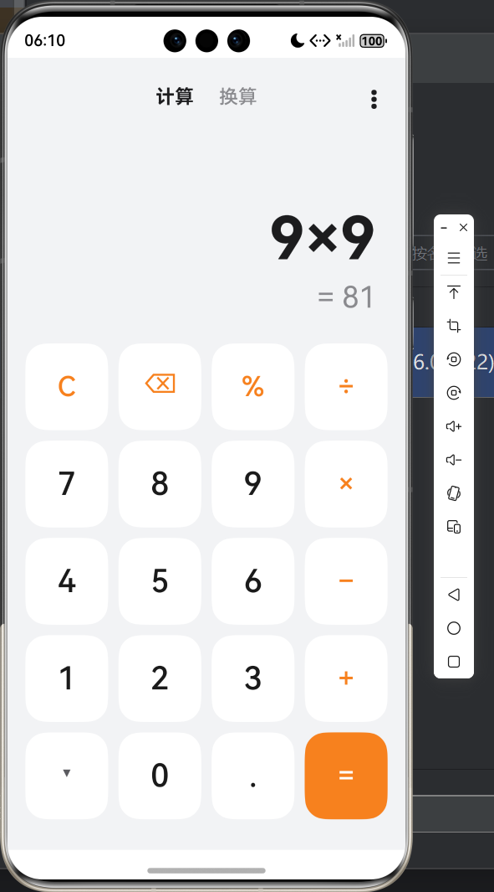
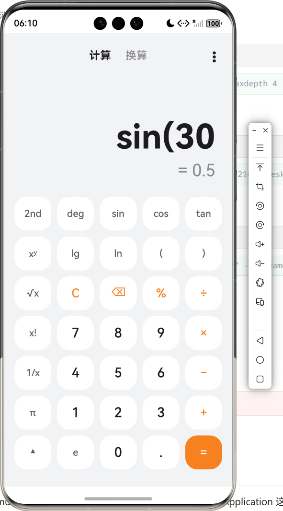
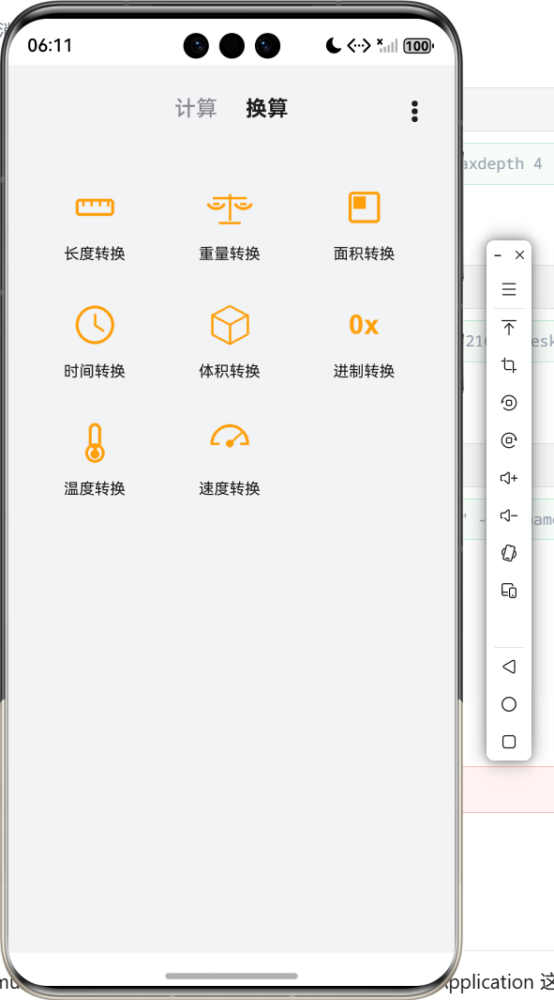
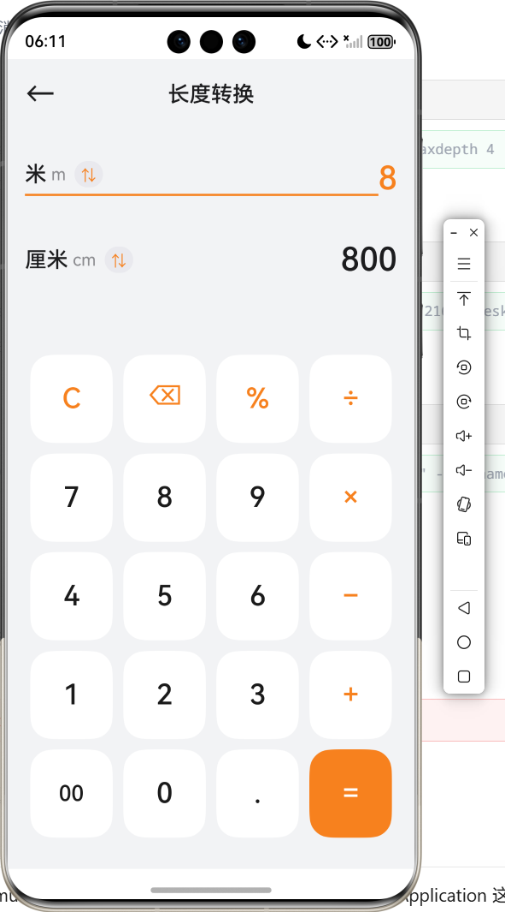

<center>姓名：贺凡思杰  学号：24020007043</center>

| 姓名和学号？         | 贺凡思杰，24020007043     |
| -------------------- | -------------------------------- |
| 本实验属于哪门课程？ | 中国海洋大学26夏《移动软件开发》 |
| 实验名称？           | 实验5：鸿蒙开发入门及计算器开发 |
| 博客地址？           | https://commings-jie.github.io/ |
| Github仓库地址？     | https://github.com/Commings-Jie/weixin-xiaochengxu |

## 一、实验内容

### 1.1 实验环境准备

- **操作系统**：Windows 11（64 位）
- **开发工具**：DevEco Studio（华为官方 IDE，Stage 模型）
- **SDK / API**：HarmonyOS 6.0.2，compatibleSdkVersion / targetSdkVersion 6.0.2(22)
- **开发语言**：ArkTS（TypeScript 扩展，声明式 UI）
- **运行环境**：鸿蒙模拟器（Device Manager，镜像路径 `D:\deveco\Emulator`）
- **工程位置**：`C:\Users\21673\DevEcoStudioProjects\MyApplication`（模块名 `entry`）

### 1.2 实验任务

1. 安装 DevEco Studio，在 Device Manager 中创建并启动模拟器；
2. 新建空 Ability 工程，先运行 Hello World 验证「编译 → 推包 → 模拟器运行」的完整流程；
3. 参考华为官方教程实现一个简易计算器，并进行**个性化创新开发**。

最终作品是一个「**计算器 + 单位换算**」二合一的工具应用：

- **计算**：支持四则运算、科学计算（三角函数/对数/开方/阶乘/倒数/幂）、括号、百分号、正负号、实时结果预览、历史记录、亮/暗主题；
- **换算**：长度/重量/面积/时间/体积/进制/温度/速度 8 大类目双向换算，自带数字键盘与千分位显示；
- 计算内核为**自研表达式求值引擎**（调车场算法 + 高精度字符串十进制运算），未使用系统自带的 `eval`。

### 1.3 应用实现

#### 1.3.1 项目文件结构

```
MyApplication/
├── AppScope/
│   ├── app.json5                     # 应用级配置（bundleName、版本号）
│   └── resources/                    # 应用级资源
├── entry/                            # 工程模块
│   ├── build-profile.json5           # 模块构建配置（apiType: stageMode）
│   └── src/main/
│       ├── module.json5              # 模块配置：EntryAbility、入口页面等
│       ├── ets/
│       │   ├── entryability/
│       │   │   └── EntryAbility.ets  # UIAbility：初始化偏好存储、加载首页
│       │   ├── entrybackupability/
│       │   │   └── EntryBackupAbility.ets
│       │   ├── pages/
│       │   │   ├── Index.ets         # 计算器主页（计算/换算 Tab + 键盘 + 历史）
│       │   │   ├── ConvertHome.ets   # 单位换算首页（3 列类目网格）
│       │   │   └── ConvertDetail.ets # 换算详情页（双向单位/数值 + 数字键盘）
│       │   ├── common/
│       │   │   ├── constants/        # CommonConstants / ConvertConstants / ThemeColors
│       │   │   └── utils/            # CalculateUtil / DecimalUtil / ConvertUtil /
│       │   │                         #   PreferencesUtil / CheckEmptyUtil / Logger
│       │   └── viewmodel/            # PressKeysItem / PresskeysViewModel（计算器键盘）
│       │                             # ConvertKeysItem / ConvertKeysViewModel（换算键盘）
│       └── resources/base/
│           ├── element/              # 字符串/颜色资源
│           ├── media/                # 图标：类目图标 conv_length.png 等、启动图
│           └── profile/main_pages.json  # 页面路由：Index / ConvertHome / ConvertDetail
├── build-profile.json5               # 工程级构建配置
├── oh-package.json5                  # 依赖声明（@ohos/hypium 等测试库）
└── hvigorfile.ts                     # 构建脚本
```

#### 1.3.2 核心代码

**① Ability 入口与页面路由（EntryAbility.ets / main_pages.json）：**

应用入口在 `module.json5` 中声明为 `EntryAbility`。Ability 启动时用 `preferences` 轻量偏好库初始化本地存储，并把「是否暗色」「历史记录」灌入全局 `AppStorage`，供页面用 `@StorageLink` 双向绑定（API 18+ 之后 `PersistentStorage` 已废弃，改用这种手动读写方式）：

```typescript
// EntryAbility.ets（节选）
onCreate(want, launchParam): void {
  PreferencesUtil.init(this.context);                       // 打开偏好存储
  AppStorage.setOrCreate(KEY_IS_DARK,
    PreferencesUtil.getBoolean(KEY_IS_DARK, false));        // 上次的主题
  AppStorage.setOrCreate(KEY_HISTORY,
    PreferencesUtil.getString(KEY_HISTORY, ''));            // 上次的计算历史
}
onWindowStageCreate(windowStage): void {
  windowStage.loadContent('pages/Index', (err) => { ... });
}
```

```json
// main_pages.json —— 三个页面按路由跳转
{ "src": ["pages/Index", "pages/ConvertHome", "pages/ConvertDetail"] }
```

**② 计算器主页（pages/Index.ets）——状态驱动的实时求值：**

页面用 `@State` 保存输入表达式，并通过 `@Watch` 在每次输入变化时**立即重新求值**，实现“边输边算”的实时结果预览；等号按下后通过 `justEvaluated` 状态交换输入式与结果的字体主次（大结果在下、原表达式缩为小字在上）：

```typescript
@Entry
@Component
struct Index {
  @State @Watch('onInputChange') inputValue: string = '';  // 输入式
  @State result: string = '0';                             // 实时结果
  @State showSci: boolean = false;                         // 是否展开科学键盘
  @State secondMode: boolean = false;                      // 2nd 反三角切换
  @State degMode: boolean = true;                          // 角度/弧度
  @State justEvaluated: boolean = false;                   // 刚按过等号
  @StorageLink('isDark') @Watch('onThemeChange') isDark: boolean = false;

  onInputChange(): void {                                  // 每次输入即求值
    if (CheckEmptyUtil.isEmpty(this.inputValue)) { this.result = '0'; return; }
    this.result = this.calculator.evaluate(this.balanceParens(this.inputValue), this.degMode);
  }

  build() {
    Column() {
      this.ToolBar()               // 计算/换算 Tab + ⋮ 菜单（历史/主题）
      if (this.showHistory) { this.HistoryPanel() }        // 历史面板
      else { this.DisplayArea() }                          // 输入式 + 实时结果
      this.KeyboardArea()          // 底部键盘（5×4 / 7×5）
    }
    .width('100%').height('100%')
    .backgroundColor(this.theme().pageBg)
  }
}
```

**③ 键盘渲染与按键分发：**

键盘不写死在 WXML/XML 里，而是由数据模型 + 布局函数驱动。`PressKeysItem` 记录按键文字、类型与占列数，颜色由当前主题决定（切亮暗色无需重建按键）：

```typescript
// viewmodel/PressKeysItem.ets
export enum KeyType { DIGIT, OPERATOR, FUNCTION, EQUAL, SCI, EXPAND }

export default class PressKeysItem {
  text: string; type: KeyType; span: number;
  constructor(text: string, type: KeyType, span: number = 1) { ... }
}
```

```typescript
// viewmodel/PresskeysViewModel.ets（节选）—— 基础键盘 5×4
export function getPressKeys(showSci, secondMode, degMode): PressKeysItem[][] {
  if (!showSci) {
    return [
      [C, ⌫, %, ÷], [7, 8, 9, ×], [4, 5, 6, −], [1, 2, 3, +],
      [▾(展开), 0, ., =]                     // 左下角为科学键盘展开键
    ];
  }
  return [  // 展开后 7 行 × 5 列，与华为计算器科学键盘布局一致
    [2nd, deg, sin, cos, tan],
    [xʸ, lg, ln, (, )],
    [√x, C, ⌫, %, ÷],
    [x!, 7, 8, 9, ×],
    [1/x, 4, 5, 6, −],
    [π, 1, 2, 3, +],
    [▴(收起), e, 0, ., =]
  ];
}
```

页面中 `KeyboardArea` 用双层 `ForEach` 渲染行与键，键上统一 `onClick(() => this.onKeyClick(item))`，再按类型分发到 数字 / 运算符 / 功能 / 科学键 / 等号 的处理函数：

```typescript
private onKeyClick(item: PressKeysItem): void {
  if (this.showHistory) { this.showHistory = false; }   // 历史页按任意键先回计算界面
  if (item.type === KeyType.EXPAND)   { this.showSci = !this.showSci; return; }
  if (item.type === KeyType.FUNCTION) { this.handleFunction(item.text); return; }
  if (item.type === KeyType.EQUAL)    { this.handleEqual(); return; }
  if (item.type === KeyType.SCI)      { this.handleSci(item.text); return; }
  if (item.type === KeyType.OPERATOR) { this.handleOperator(item.text); return; }
  this.handleDigit(item.text);
}
```

> 关键细节：`ForEach` 的 key 里带上键盘状态（`sci/base` + `-2nd` + `-deg/-rad`），否则展开/收起科学键盘或切换 2nd 时，ArkUI 会复用旧行节点导致**键盘布局错乱**。

**④ 输入合法性守卫与表达式求值：**

输入阶段做了一整套合法性判断，避免拼出非法表达式，例如：`( ` 后只能跟负号不能跟 `+×÷`；`)`、`x²`、`x!`、`%`、`π` 后不能直接跟数字；右括号必须与左括号配对；`sin(` 只能出现在操作数开头等：

```typescript
private canStartOperand(): boolean {  // 能否开始新操作数：开头/运算符/左括号后
  let last = this.lastChar();
  return CheckEmptyUtil.isEmpty(this.inputValue) || this.isOperator(last) || last === '(';
}
private openParenCount(): number { ... }         // 统计未配对左括号
private balanceParens(expression: string): string {  // 等号前自动补齐右括号：sin(30 → sin(30)
  let open = 0;
  for (let i = 0; i < expression.length; i++) {
    if (expression.charAt(i) === '(') open++;
    else if (expression.charAt(i) === ')') open--;
  }
  while (open > 0) { expression += ')'; open--; }
  return expression;
}
```

自研求值引擎 `CalculateUtil` 采用**调车场算法（Shunting-yard）**：中缀表达式 → 词法分析（tokenize）→ 后缀表达式 RPN（toRPN）→ 栈计算（evalRPN）。相比递归下降，新增 `sin`、`x²`、阶乘等只需在 `tokenize` 加词法、在 `precedence` 加优先级，扩展性好；任何异常统一返回「出错」而不崩溃：

```typescript
// common/utils/CalculateUtil.ets（节选）
evaluate(expression: string, degreeMode: boolean = true): string {
  try {
    let tokens = this.tokenize(this.normalize(expression));  // − × ÷ → - * /
    let rpn = this.toRPN(tokens);                            // 转后缀
    let value = this.evalRPN(rpn, degreeMode);               // 栈计算
    let formatted = DecimalUtil.format(value);
    return DecimalUtil.needScientific(formatted)
      ? DecimalUtil.toScientific(formatted, 9)               // 过大/过小转科学计数
      : formatted;
  } catch (err) { return CommonConstants.RESULT_ERROR; }
}
```

**⑤ 高精度小数运算（DecimalUtil.ets）：**

浮点运算存在精度误差（如 `0.1+0.2`、`1÷3`）。`DecimalUtil` 把数字拆成「符号 + 整数部分 + 小数部分」的字符串结构，**手写十进制加/减/乘/除**（`addUnsigned/subUnsigned/mulUnsigned/divUnsigned`），除法按精度截断、结果做去前导零/去尾零整理，并支持科学计数法自动切换，保证结果准确、可预期：

```typescript
// DecimalUtil.ets（节选）
static div(a: string, b: string, precision: number = 10): string { ... }  // 手写除法
static format(value: string): string { ... }        // 归一化：去前导零/尾零
static needScientific(value: string): boolean { ... } // 整数超 12 位或 ≤1e-6
static toScientific(value: string, digits: number): string { ... }
```

**⑥ 亮 / 暗主题：**

`ThemeColors` 把页面背景、键背景、文字、等号实色键等收敛成一套配色接口，`LIGHT_THEME` 走 iOS 计算器风格（白键 + 橙色运算符），`DARK_THEME` 走黑底灰键风格。每个按键的背景/文字颜色都通过 `keyBgColor/keyTextColor` 从主题取，切换主题只改一个 `isDark` 状态即全局换肤：

```typescript
export const DARK_THEME: ThemeColors = {
  pageBg: '#000000', panelBg: '#1C1C1E',
  digitBg: '#2C2C2E', digitText: '#FFFFFF',
  functionText: '#FF9F0A', operatorText: '#FF9F0A',
  equalBg: '#FF9F0A', equalText: '#FFFFFF', ...
};
```

**⑦ 历史记录（HistoryPanel + PreferencesUtil）：**

每按一次等号，把「表达式#结果」以 `|` 分隔拼成字符串存入 `@StorageLink('history')`（最多 20 条），`@Watch` 自动写回 preferences 落盘；历史面板用 `List` 展示，点击某条可把结果回填到输入区继续计算，右上角支持一键清空：

```typescript
private addHistory(expression: string, value: string): void {
  let list = this.getHistoryList();
  list.unshift(expression + '#' + value);            // HISTORY_EQUAL = '#'
  if (list.length > 20) list = list.slice(0, 20);    // MAX_HISTORY = 20
  this.historyText = list.join('|');                 // @Watch 自动落盘
}
```

**⑧ 单位换算（ConvertHome / ConvertDetail + ConvertUtil）：**

换算首页用 `Flex` 换行 + `ForEach` 渲染 3 列类目网格（长度/重量/面积/时间/体积/进制/温度/速度），点击用 `getUIContext().getRouter().pushUrl({ url: 'pages/ConvertDetail', params: { categoryId } })` 跳转并把类目 id 传过去：

```typescript
// ConvertHome.ets（节选）
Flex({ wrap: FlexWrap.Wrap }) {
  ForEach(CONVERT_CATEGORIES, (item: Category) => { this.GridItem(item) },
    (item) => item.id)
}
...
private categoryIcon(id: string): Resource {   // 每个类目配一张线性图标
  switch (id) {
    case 'length': return $r('app.media.conv_length');
    case 'weight': return $r('app.media.conv_weight');
    ... default: return $r('app.media.conv_speed');
  }
}
```

换算详情页展示上下两行（源单位 → 目标单位），点 `⇅` 原地弹出单位选择列表；输入哪行哪行变橙色主色，另一次换算结果实时刷新；底部是换算专用数字键盘（进制模式下非当前基数的键自动置灰，如二进制只亮 0/1）。换算核心 `ConvertUtil` 按类目类型分三种处理：

```typescript
// ConvertUtil.ets（节选）
static convert(value, fromId, toId, category): string {
  if (category.type === 'radix')       return this.convertRadix(raw, fromId, toId, category); // 进制：2/8/10/16 互转
  if (category.type === 'temperature') return this.convertTemperature(num, fromId, toId);     // 温度：先统一转摄氏度
  return this.convertRatio(num, fromId, toId, category);   // 比值类：经基准单位中转 ×factorA÷factorB
}
```

单位数据集中在 `ConvertConstants.ets`：每个 `Unit` 用相对基准单位的 `factor`（或进制的 `base`）描述，新增单位/类目只需加一条数据；温度与进制因换算非线性单独走分支处理。

#### 1.3.3 功能说明

| 功能 | 实现方式 |
|------|---------|
| 四则运算 | 中缀表达式 → 调车场算法转后缀 → 栈计算，支持 `+ − × ÷` |
| 实时结果 | `@State @Watch` 监听输入式，每次变化立即 `evaluate` 并刷新下方结果 |
| 高精度 | `DecimalUtil` 字符串手写加减乘除，避免浮点误差；除法按精度截断 |
| 科学计数 | 整数超 12 位或 ≤1e-6 自动转科学计数法显示 |
| 基础键盘 | 5 行 × 4 列（C/⌫/%、数字、运算符、展开键、等号），数据驱动渲染 |
| 科学键盘 | 左下角展开为 7×5：2nd/deg/sin/cos/tan、xʸ/lg/ln/括号、√x/x!/1/x、π/e |
| 2nd 切换 | 一键把 sin/cos/tan 切为 sin⁻¹/cos⁻¹/tan⁻¹ 反三角 |
| deg/rad | 角度/弧度制切换，三角函数按模式换算 |
| 括号 | 只能合法插入；等号求值前自动补齐缺失右括号 |
| 输入合法性 | 禁止 `( 后跟运算符（负号除外）、`)x!%π 后直接接数字、重复小数点` 等 |
| 等号排版 | 等号后表达式缩为小字在上、结果大而粗在下；再输数字自动开始新一轮 |
| 历史记录 | 最近 20 条，List 展示、点击回填、一键清空，preferences 持久化 |
| 亮/暗主题 | ThemeColors 配色接口 + `@StorageLink('isDark')`，重启仍保留 |
| 本地存储 | `preferences` 偏好库（替代已废弃的 PersistentStorage），经 AppStorage 桥接页面 |
| 单位换算 | 8 大类目、三列网格入口、类目图标资源 |
| 双向换算 | from/to 两行，点行切换输入，另侧实时换算，千分位显示 |
| 单位选择 | `⇅` 原地弹出单位列表，不必跳页 |
| 进制/温度 | 进制约束可用键（基数外置灰）、支持负数与 A–F；温度先统一转摄氏度 |
| 数字键盘 | 换算专用键盘（C/⌫/00/0/./进制字母），与计算器键盘分离 |

#### 1.3.4 运行效果

<!-- ⚠️ 截图已就位：images/ 下为 DevEco Studio 模拟器运行截图 -->









### 1.4 关键技术点

1. **ArkTS 声明式 UI**：`@Entry/@Component` 声明页面组件，`@State/@StorageLink` 驱动状态，`@Builder` 抽取局部 UI，`ForEach` 批量渲染，整体是“数据变化 → 框架自动刷新”的声明式写法，与小程序 setData 思路类似但更彻底。

2. **@Watch 状态监听实现“边输边算”**：给输入式挂 `@Watch`，每次按键 setData（改 `inputValue`）后自动重算结果，实时预览的同时还能做等号前后字体的主次切换动画。

3. **调车场算法（Shunting-yard）**：自研表达式引擎把中缀转后缀再栈求值，新增函数/运算符只需扩展词法与优先级表，代码结构比递归下降更易扩展。

4. **字符串高精度十进制运算**：浮点 `0.1+0.2` 之类误差在计算器场景不可接受，手写 `DecimalUtil` 的加/减/乘/除（符号 + 整数部分 + 小数部分拆分），并做去前导零、截断、科学计数法，保证结果可控。

5. **输入合法性状态机**：能否开始操作数（`canStartOperand`）、是否以操作数结尾（`endsWithOperand`）、括号配对计数、当前数字是否已有小数点、一元负号归属等一套判定函数，从源头拦截非法表达式。

6. **数据驱动键盘**：键盘布局是纯数据（二维 `PressKeysItem[]`），显示颜色由主题决定，UI 只负责遍历渲染；`ForEach` 的 key 必须包含键盘状态，否则框架复用节点导致布局错乱——这是实践中踩过的坑。

7. **主题与持久化**：颜色收敛进 `ThemeColors` 接口 + 亮暗两份实现；`PersistentStorage` 在 API 18+ 废弃后改用 `preferences` 偏好库 + `AppStorage.setOrCreate/@StorageLink` 桥接，实现主题/历史重启保留。

8. **路由与传参**：`getUIContext().getRouter().pushUrl/back()` 实现页面跳转，`params` 传类目 id，换算详情 `onPageShow` 里取参并校验类目是否存在，非法参数直接返回上级页。

9. **换算引擎的分类抽象**：单位统一用「基准单位系数 factor」描述（`ConvertConstants.ets` 一条数据 = 一个单位），比值/温度/进制三种换算策略分派，新增类目几乎零代码。

10. **页面/数据/工具分层**：`pages`（UI）、`viewmodel`（键盘数据模型）、`common/utils`（纯逻辑工具）、`common/constants`（常量/主题/单位数据）各司其职，逻辑与界面解耦，便于单独测试。

## 二、问题总结与体会

### 2.1 遇到的问题及解决方案

**问题1：科学键盘展开/收起、2nd、deg 切换后键盘布局错乱**

- **现象**：键盘展开成 7×5 后再收起，或切换 2nd/deg 时，某些行/按键文字与位置对不上，甚至出现旧内容残留
- **原因**：`ForEach` 按 key 做节点复用与 diff。键盘行内容变了但 key 没变（比如都从“第 3 行”开始编号），框架就复用了旧行节点
- **解决**：生成每行 key 时拼上键盘状态前缀，`showSci/secondMode/degMode` 任一变化整组重建键盘：

```typescript
// key 里带上键盘状态，任一变化整组重建
let prefix: string = (this.showSci ? 'sci' : 'base')
  + (this.secondMode ? '-2nd' : '') + (this.degMode ? '-deg' : '-rad');
return prefix + '-' + rowIndex;
```

**问题2：0.1+0.2、1÷3 等浮点误差与超长小数**

- **现象**：直接用 `Number` 计算时出现 `0.30000000000000004` 这类误差，除法小数位也不可控，结果区被撑得很长
- **原因**：JavaScript/HarmonyOS 浮点使用 IEEE 754 双精度，十进制小数无法精确表示；除法更会产生无限小数
- **解决**：自研 `DecimalUtil` 字符串十进制运算（符号 + 整数部分 + 小数部分），加/减/乘/除全部手写，除法按精度截断、结果统一 `format` 整理，过大过小再自动转科学计数法

**问题3：输入 “0” 后再按数字显示成 “02”**

- **现象**：先按 0 再按 2，表达式变成 `02`；`−0` 后接数字也变成 `−02`
- **原因**：数字拼接逻辑没有处理“当前正在输入的数字是 0”的前导零情况
- **解决**：用 `lastNumberStart` 找到当前数字（含一元负号）起点，若当前数字恰为 `0` 或 `−0` 则直接整体替换为新数字，而不是追加

**问题4：能拼出 `5)2`、`50%2`、`(+` 这类非法表达式**

- **现象**：右括号或 `%`/`x²`/`x!` 之后继续按数字、`(` 后按 `+`，求值出错显示“出错”
- **原因**：输入阶段没有“上下文合法性”约束，所有键都可以无脑拼接
- **解决**：引入 `canStartOperand()`（能否开始新操作数）、`endsWithOperand()`（当前是否以操作数结尾）、`openParenCount()`（括号配对）等守卫函数，非法按键直接忽略；等号前 `balanceParens` 自动补齐右括号

**问题5：PersistentStorage 在 API 18+ 编译报废弃**

- **现象**：按旧教程用 `PersistentStorage.persistProp` 保存主题/历史，高版本 API 下提示已废弃
- **原因**：HarmonyOS 后续版本用 `AppStorage` + `preferences` 取代了老的 `PersistentStorage`
- **解决**：用 `preferences.getPreferencesSync` 打开偏好库，Ability `onCreate` 时读出来 `AppStorage.setOrCreate` 灌入全局，页面 `@StorageLink` 正常双向绑定，`@Watch` 回写并 `flushSync` 落盘

**问题6：换算/计算时数值与 UI 状态不同步、Builder 传参丢响应式**

- **现象**：换算详情里把对象/数组直接传给 `@Builder` 子块，改单位后界面不刷新
- **原因**：ArkUI 的 `@Builder` 默认**按值传参**，传入的是拷贝的快照，状态变化不会触发子块更新
- **解决**：`@Builder` 内不传整对象，只传一个 mode 字符串，单位/数值在子块内部直接读 `this` 上的 `@State`（`rowUnitId(mode)/rowValue(mode)`），保证响应式正常

**问题7：自定义符号在表达式里算错（− × ÷ 与 - * / 混用）**

- **现象**：界面用 `− × ÷`、后缀用 `² ! ⁻¹`，直接拿去求值解析出错
- **原因**：UI 显示符号与求值引擎识别的运算符不一致
- **解决**：`CalculateUtil.normalize()` 先把界面符号统一替换成引擎符号（`−→-`、`×→*`、`÷→/`），`tokenize` 再按词法逐字符切分，并支持函数名、常量、后缀符号等词法单元

### 2.2 收获与体会

1. **从“小程序”跨到“鸿蒙 ArkTS”**：微信小程序是 WXML/WXSS + JS 的类 Vue 写法，鸿蒙是 ArkTS 声明式 UI + 状态管理（@State/@StorageLink/@Watch/@Builder），体会到两种框架在“数据驱动视图”上殊途同归，切换成本比想象低。

2. **亲手搭出一套编译 → 推包 → 模拟器/真机运行的完整工具链**：从安装 DevEco Studio、Device Manager 创建模拟器（镜像放 `D:\deveco\Emulator`），到 Hello World 验证，再到真实工程的调试，对鸿蒙应用从源码到上机的全流程有了直观认识。

3. **自己写表达式求值引擎比想象中有成就感**：调车场算法（中缀→后缀→栈求值）从课本概念变成能跑的产品代码，还顺带处理了优先级、括号配对、函数调用、后缀运算符和错误兜底。

4. **“精度”是计算器这类工具的生命线**：为了不出现 `0.30000000000000004`，手写字符串十进制四则运算是一笔“值得”的投入，也让我重新理解了浮点数表示与精度问题的本质。

5. **好的架构让“加功能”变得便宜**：单位、键盘、主题都用数据 + 常量表驱动，加一个换算类目 = 加一行单位数据，加一个科学键 = 加一个键位 + 词法 + 优先级，真正体会到数据驱动与分层的好处。

6. **踩坑是最好的老师**：ForEach 节点复用的 key 陷阱、@Builder 按值传参丢响应式、PersistentStorage 废弃迁移、UI 符号与引擎符号不一致……这些只有真机/模拟器上反复试才会发现，也让我更重视 ArkUI 的渲染复用规则。

7. **“个性风格”体现在细节**：亮/暗双主题、科学键盘 2nd/deg 互斥切换、等号后输入式与结果主次互换的排版动效、历史记录点击回填等，让一个“简易计算器”有了完整、顺手、好看的产品质感。
