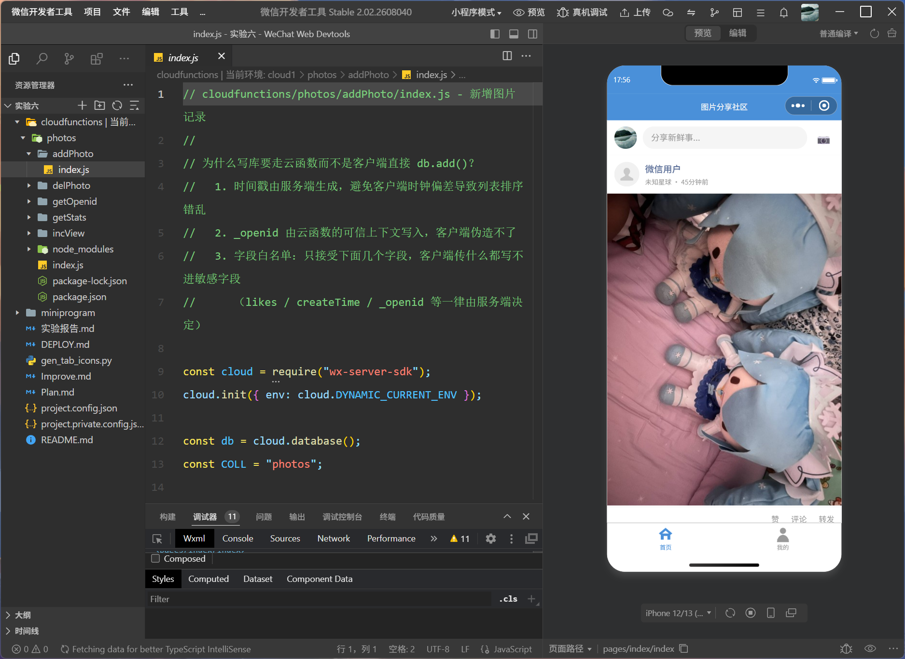
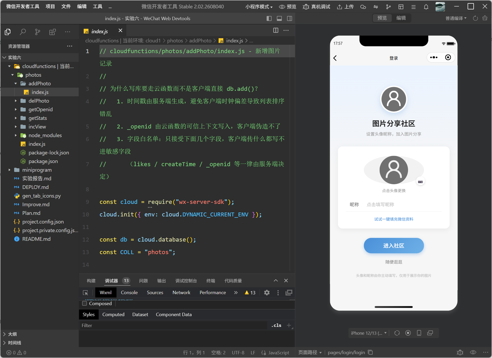
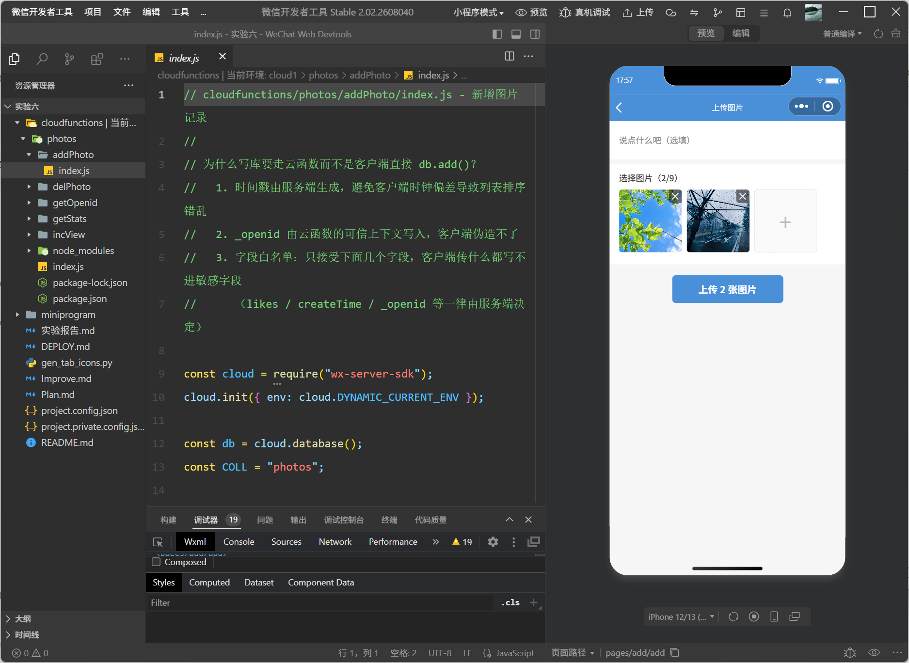
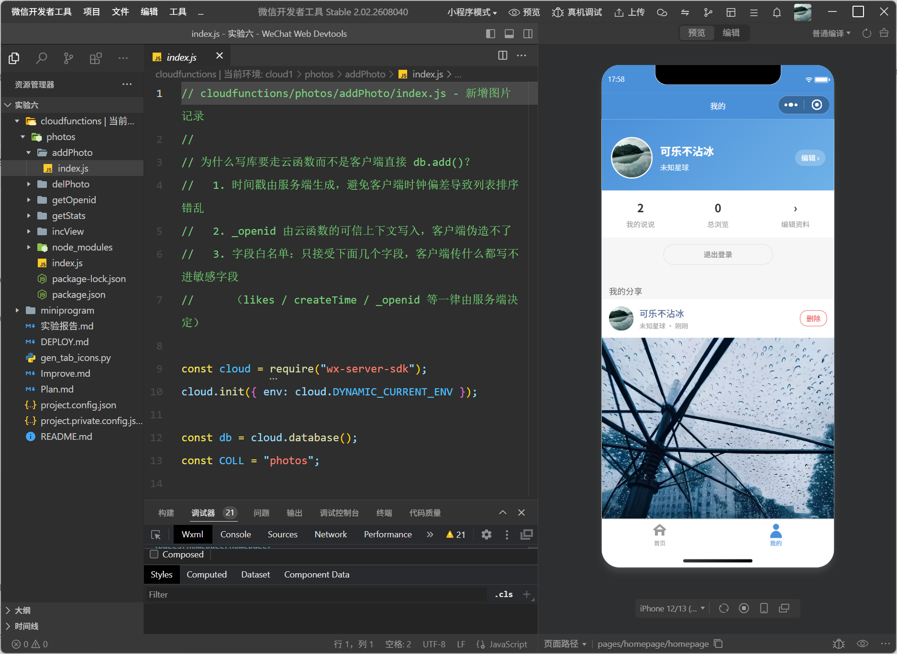

<center>姓名：贺凡思杰  学号：24020007043</center>

| 姓名和学号？         | 贺凡思杰，24020007043     |
| -------------------- | -------------------------------- |
| 本实验属于哪门课程？ | 中国海洋大学26夏《移动软件开发》 |
| 实验名称？           | 实验6：微信小程序云开发——图片分享社区 |
| 博客地址？           | https://commings-jie.github.io/ |
| Github仓库地址？     | https://github.com/Commings-Jie/weixin-xiaochengxu |

## 一、实验内容

### 1.1 实验环境准备

- **操作系统**：Windows 11
- **开发工具**：微信开发者工具稳定版（基础库 3.17.2）
- **后端服务**：微信云开发（云数据库 + 云存储 + 云函数）
- **云开发环境 ID**：`cloud1-d4g1avw2tea6fe5fd`
- **数据库集合**：`photos`（权限：所有用户可读，仅创建者及管理员可写）

### 1.2 实验任务

本实验综合应用小程序云开发的基础知识，制作一个**图片分享社区**小程序：

1. 使用「小程序·云开发」模板初始化项目，在云开发控制台创建 `photos` 云数据库集合并设置权限；
2. 设计并实现 **首页（图片流列表）**、**上传图片页**、**图片展示页**、**个人主页** 四个页面；
3. 通过**云存储**上传图片，通过**云数据库**记录图片地址、上传者信息与上传日期；
4. 编写**云函数** `getOpenid` 获取用户 openid，掌握云函数的创建、部署与调用；
5. 实现首页图片列表展示、点击头像跳转个人主页、点击图片进入展示页、下载/分享/全屏预览等功能。

在完成教材基础功能之外，本实验还额外增强了：services 三层分层架构、云函数单入口路由、删除功能与越权防护、多图上传与压缩、分页加载、头像昵称填写能力登录（新账号 uid 体系）、QQ空间风格的首页改版等（详见 1.3）。

### 1.3 小程序实现

#### 1.3.1 项目文件结构

```
实验六/
├── cloudfunctions/
│   └── photos/                   # 云函数统一入口（一个函数，内部按 type 路由）
│       ├── index.js              # 路由分发（switch(event.type)）
│       ├── getOpenid/index.js    # 取 openid
│       ├── addPhoto/index.js     # 写库（服务端时间戳 + 字段白名单 + uid）
│       ├── delPhoto/index.js     # 删库 + 删云存储（归属双重校验）
│       ├── getStats/index.js     # 社区 / 个人统计（聚合）
│       └── incView/index.js      # 浏览量 +1
├── miniprogram/
│   ├── app.js                    # 云初始化、登录态恢复
│   ├── app.json                  # 全局配置（页面路由、tabBar）
│   ├── app.wxss                  # 全局公共样式
│   ├── images/
│   │   ├── avatar.png            # 默认头像
│   │   └── tab/                  # tabBar 图标（home/mine，选中/未选中）
│   ├── components/
│   │   └── photo-card/           # 图片说说卡片组件（首页/我的复用）
│   ├── pages/
│   │   ├── index/                # 首页（tab1）：社区图片流 + 发说说入口
│   │   ├── homepage/             # 我的（tab2）：登录引导 + 我的说说
│   │   ├── add/                  # 上传图片页（多选/压缩/历史）
│   │   ├── detail/               # 图片展示页（下载/分享/预览/删除）
│   │   └── login/                # 登录页（chooseAvatar + type=nickname）
│   ├── services/
│   │   ├── api.js                # 统一数据出口（页面只依赖这一层）
│   │   ├── cloud.js              # 唯一直接调用 wx.cloud.* 的地方
│   │   └── user.js               # 登录态与账号（uid）管理
│   └── utils/
│       ├── config.js             # 配置集中管理（环境ID/集合名/分页/缓存key）
│       └── util.js               # 时间格式化 + toast/loading 封装 + 云路径生成
├── project.config.json           # 项目配置（appid、miniprogramRoot 等）
└── gen_tab_icons.py              # 生成 tabBar 图标的辅助脚本（PIL）
```

#### 1.3.2 核心代码

**① 全局配置（app.json）——页面注册与 tabBar：**

```json
{
  "pages": [
    "pages/index/index",
    "pages/homepage/homepage",
    "pages/detail/detail",
    "pages/add/add",
    "pages/login/login"
  ],
  "window": {
    "backgroundColor": "#F6F6F6",
    "navigationBarBackgroundColor": "#4A90D9",
    "navigationBarTitleText": "图片分享社区",
    "navigationBarTextStyle": "white"
  },
  "tabBar": {
    "color": "#999999",
    "selectedColor": "#4A90D9",
    "list": [
      { "pagePath": "pages/index/index", "text": "首页",
        "iconPath": "images/tab/home.png", "selectedIconPath": "images/tab/home_on.png" },
      { "pagePath": "pages/homepage/homepage", "text": "我的",
        "iconPath": "images/tab/mine.png", "selectedIconPath": "images/tab/mine_on.png" }
    ]
  }
}
```

将首页与个人主页作为 tabBar 两个标签页（教材中个人主页由首页头像跳转进入），tabBar 图标用 PIL 脚本 `gen_tab_icons.py` 生成 81×81 的实心 PNG（未选中灰、选中蓝）。

**② 云开发环境初始化（app.js / utils/config.js）：**

```javascript
// app.js —— 启动时初始化云环境，并恢复上次登录态
App({
  onLaunch: function () {
    wx.cloud.init({ env: config.CLOUD_ENV, traceUser: true });
    const profile = user.init();           // 读本地缓存恢复登录态
    if (profile) {
      this.globalData.userInfo = profile;
      this.globalData.openid = profile.openid;
    }
  },
  ensureOpenid: function () { ... }        // 懒加载 openid，需要时才调云函数
})
```

```javascript
// utils/config.js —— 环境 ID、集合名、分页等全部集中，部署时只改这一处
const CLOUD_ENV = "cloud1-d4g1avw2tea6fe5fd";
const COLLECTIONS = { PHOTOS: "photos" };
const PAGE_SIZE = 20;          // 云数据库单次 get() 上限
const MAX_UPLOAD = 9;          // 单次最多选图数
```

**③ 云函数统一入口（cloudfunctions/photos/index.js）：**

将多个云函数收敛成一个入口，用 `event.type` 分发，部署和管理都更简单：

```javascript
const getOpenid = require("./getOpenid/index");
const addPhoto = require("./addPhoto/index");
const delPhoto = require("./delPhoto/index");
const getStats = require("./getStats/index");
const incView = require("./incView/index");

exports.main = async (event, context) => {
  const type = String(event.type || "").trim();
  switch (type) {
    case "getOpenid": return await getOpenid.main(event, context);
    case "addPhoto":  return await addPhoto.main(event, context);
    case "delPhoto":  return await delPhoto.main(event, context);
    case "getStats":  return await getStats.main(event, context);
    case "incView":   return await incView.main(event, context);
    default: return { code: -1, msg: "未知操作：" + type };
  }
};
```

新增图片走云函数写库而不是客户端直连 `db.add()`，原因：① 时间戳由服务端生成，避免客户端时钟偏差导致排序错乱；② `_openid` 由云函数可信上下文写入，客户端伪造不了；③ 采用字段白名单，只接受约定的几个字段：

```javascript
// cloudfunctions/photos/addPhoto/index.js（节选）
const OPENID = cloud.getWXContext().OPENID;
const data = {
  photoUrl: limit(fileID, 500),
  desc: limit(event.desc, 200),
  uid: limit(event.uid, 64),          // 当前账号 ID（见 user.js）
  avatarUrl: limit(event.avatarUrl, 500),
  nickName: limit(event.nickName, 50),
  province: limit(event.province, 50),
  _openid: OPENID,
  createTime: Date.now(),             // 服务端时间戳
  viewCount: 0
};
await db.collection("photos").add({ data: data });
```

**④ services 三层架构（页面 → api.js → cloud.js）：**

页面**永不直接调用 `wx.cloud`**，统一走 `services/api.js` 数据出口，由它统一错误兜底；`services/cloud.js` 是全项目唯一出现 `wx.cloud.*` 的文件，方便未来整体更换数据源：

```javascript
// services/api.js（节选）—— 统一错误处理：失败 toast 并返回安全兜底值
function guard(promise, fallback) {
  return promise.catch(function (e) {
    console.error("[api]", e);
    util.toast((e && e.message) || "操作失败，请重试");
    return fallback;
  });
}
module.exports = {
  listPhotos:  (opt) => guard(cloud.listPhotos(opt), { list: [], hasMore: false }),
  getPhoto:    (id)  => guard(cloud.getPhoto(id), null),
  getStats:    (uid) => guard(cloud.getStats(uid || ""), null),
  addPhoto:    (filePath, desc) => guard(cloud.addPhoto(filePath, desc), null),
  removePhoto: (id, uid) => guard(cloud.removePhoto(id, uid), false),
  ...
};
```

```javascript
// services/cloud.js（节选）—— 列表分页：支持按 uid 查「我的」，不传查全社区
async function listPhotos(opt) {
  opt = opt || {};
  const uid = opt.uid, page = opt.page || 0;
  const pageSize = opt.pageSize || config.PAGE_SIZE;
  let query = coll();
  if (uid) query = query.where({ uid: uid });
  const res = await query.orderBy("createTime", "desc")
    .skip(page * pageSize).limit(pageSize).get();
  return { list: res.data || [], hasMore: res.data.length === pageSize };
}
```

**⑤ 登录与账号体系（services/user.js）——「换头像昵称重新登录 = 新账号」：**

微信自 2022 年起废弃 `wx.getUserInfo`，教材示例中基于它的实现已不可用。本项目改用官方的**头像昵称填写能力**：`<button open-type="chooseAvatar">` + `<input type="nickname">`。为了让「只能删自己的图」在单微信号上也能演示，每次登录生成一个新的 **uid（账号ID）**，图片归属与删除权限都按 uid 判定：

```javascript
function genUid() {
  return "u" + Date.now().toString(36) + Math.random().toString(36).slice(2, 8);
}
function isLogin() {
  return !!(_profile && _profile.openid && _profile.uid); // 缺 uid 的旧缓存强制重登
}
function login(form) { /* 取 openid → 临时头像传云存储换永久 fileID → 落盘 */
  ...
  function finish(finalAvatar, openid) {
    const profile = {
      uid: genUid(),          // 本次登录 = 新账号
      openid: openid,
      nickName: nick,
      avatarUrl: finalAvatar,
      loginTime: Date.now(),
    };
    _profile = profile;
    writeStore(profile);      // 同步本地缓存 + globalData
    syncGlobal();
    return profile;
  }
}
```

> 踩坑说明：`chooseAvatar` 返回的是本地临时路径（`wxfile://…`），小程序一退出就失效，直接存库下次就白图。因此登录时会把头像上传到云存储换成 `cloud://` 永久 fileID 再持久化。

**⑥ 删除权限双重校验（前端显隐 + 云函数拦截）：**

- 前端：首页卡片 `show-delete="{{item.uid === myUid}}"`，只有当前账号的图片才渲染「删除」按钮；
- 云函数 `delPhoto` 服务端再校验一次，即使伪造请求也删不掉别人的图：

```javascript
// cloudfunctions/photos/delPhoto/index.js（节选）
if (photo._openid !== OPENID) {                       // ① 同一微信
  return { code: 403, msg: "只能删除自己的图片" };
}
if (event.uid && photo.uid && photo.uid !== event.uid) { // ② 同一账号
  return { code: 403, msg: "只能删除当前账号上传的图片" };
}
await db.collection(COLL).doc(id).remove();            // 删记录
await cloud.deleteFile({ fileList: [photo.photoUrl] }); // 连带删云存储
```

**⑦ 首页（pages/index）—— QQ空间风格动态流：**

顶部为「发说说」入口（头像 + “分享新鲜事…” + 📷），下方是说说卡片列表；点输入框/相机先确认登录态再跳转上传页：

```xml
<view class="publish-bar">
  <image class="pb-avatar" src="{{avatarUrl}}" mode="aspectFill" bindtap="onAvatarTap" />
  <view class="pb-input" bindtap="onPublishTap">
    <text class="pb-placeholder">分享新鲜事...</text>
  </view>
  <view class="pb-camera" bindtap="onPublishTap">📷</view>
</view>

<block wx:else>
  <photo-card
    wx:for="{{photoList}}" wx:key="_id"
    photo="{{item}}"
    show-delete="{{item.uid === myUid}}"
    bind:imagetap="onImageTap"
    bind:delete="onDelete"
  />
</block>
```

图片说说卡片抽成自定义组件 `photo-card`，首页与「我的」复用：作者行（头像、昵称、时间·地点）→ 正文文字在上、图片在下 → 底部「赞/评论/转发」操作栏：

```xml
<!-- components/photo-card/photo-card.wxml -->
<view class="card" wx:if="{{photo}}">
  <view class="card-head">
    <image class="avatar" src="{{photo.avatarUrl || defaultAvatar}}" mode="aspectFill" bindtap="onAvatarTap" />
    <view class="info">
      <text class="nickname">{{photo.nickName || defaultNickname}}</text>
      <text class="meta">{{locationText}} · {{timeText}}</text>
    </view>
    <view wx:if="{{showDelete}}" class="del-btn" catchtap="onDeleteTap">删除</view>
  </view>
  <view class="card-body" bindtap="onImageTap">
    <view wx:if="{{photo.desc}}" class="desc">{{photo.desc}}</view>
    <image class="pic" src="{{photo.photoUrl}}" mode="widthFix" lazy-load="{{true}}" />
  </view>
  <view class="card-actions">
    <view class="act" bindtap="onActionTap">赞</view>
    <view class="act" bindtap="onActionTap">评论</view>
    <view class="act" bindtap="onActionTap">转发</view>
  </view>
</view>
```

**⑧ 上传图片页（pages/add）：**

支持最多 9 张多选、九宫格预览与删除已选、上传前压缩、串行逐张上传、展示我的历史上传：

```javascript
// pages/add/add.js（节选）
chooseImage() {
  const remain = this.data.maxUpload - this.data.files.length;
  wx.chooseImage({ count: remain, sizeType: ["compressed"],
    success: res => this.setData({ files: this.data.files.concat(res.tempFilePaths) }) });
}

upload() {           // 逐张串行上传，压缩在 cloud.js addPhoto 内统一完成
  ...
  api.addPhoto(files[i], desc).then(record => { record ? done++ : fail++; next(i + 1); });
}
```

**⑨ 图片展示页（pages/detail）：**

根据 URL 参数 `id` 查单张记录，支持全屏预览、下载到系统相册（含相册权限被拒后的设置引导）、`open-type="share"` 分享、以及仅当前账号可见的删除：

```javascript
wx.cloud.downloadFile({ fileID: p.photoUrl })          // 云存储下载
  .then(r => wx.saveImageToPhotosAlbum({ filePath: r.tempFilePath })) // 存相册
onShareAppMessage() { return { title: "...", path: "/pages/detail/detail?id=" + id,
                               imageUrl: p.photoUrl }; } // 分享卡片带图
```

#### 1.3.3 功能说明

| 功能 | 实现方式 |
|------|---------|
| 云数据库 | 控制台创建 `photos` 集合，权限设为「所有用户可读，仅创建者及管理员可写」 |
| 图片上传 | `wx.chooseImage` 选图 → `wx.cloud.uploadFile` 传云存储（路径 `photos/{openid}/{ts}_{rand}.jpg`）→ 云函数 `addPhoto` 写库 |
| 图片列表 | `orderBy(createTime, desc)` 倒序分页读取，最新图片在最上 |
| 多图上传 | 最多 9 张多选，九宫格预览、可删已选，达到上限自动隐藏「+」 |
| 上传压缩 | `wx.compressImage` quality=80，压缩失败自动退回原图，不阻断流程 |
| 分页/触底加载 | 每页 20 条（云数据库 get 上限），`onReachBottom` 追加下一页 |
| 下拉刷新 | `enablePullDownRefresh` + `onPullDownRefresh` |
| 浏览统计 | 详情页打开调 `incView` 云函数 `_.inc(1)` 自增；首页/我的用 `getStats` 聚合展示 |
| 删除（越权防护） | 前端 `item.uid === myUid` 才显示删除；云函数 `delPhoto` 双重校验 `_openid` 与 `uid` |
| 账号体系 | 每次登录生成新 uid，`换头像昵称重新登录 = 新账号`，新账号不能删旧账号的图 |
| 登录 | 官方「头像昵称填写能力」`chooseAvatar` + `type="nickname"`，头像自动转云存储永久 fileID |
| 首页导航 | tabBar 两标签（首页 / 我的），顶部「分享新鲜事」入口替代悬浮按钮 |
| 图片展示 | 大图、全屏预览 `wx.previewImage`、下载到相册、`share` 分享带封面图 |
| 我的主页 | 按当前账号 uid 拉取我的说说，未登录显示「去登录」引导 |

#### 1.3.4 运行效果









### 1.4 关键技术点

1. **云开发三件套的配合**：云数据库（记录结构化信息）、云存储（存放图片二进制，返回 fileID 直接作为数据库字段）、云函数（取 openid、服务端写库、删除清理）。图片地址用 `cloud://` fileID 存储，前端 `<image>` 可直接渲染，无需额外鉴权。

2. **写操作走云函数、读操作直连数据库**：读列表/详情直接 `collection.get()`（受权限约束、无冷启动）；写（新增/删除）走云函数以获得服务端时间戳、可信 `_openid`、字段白名单与文件清理能力。

3. **云函数单入口路由**：一个 `photos` 云函数用 `switch(event.type)` 分发到 `getOpenid/addPhoto/delPhoto/getStats/incView` 子模块，只部署一次，避免“一个功能一个函数”的部署与冷启动开销。

4. **越权删除防护**：删除是危险操作，只靠前端隐藏按钮不够。云函数 `delPhoto` 在服务端用管理员权限读回记录后校验 `_openid`（同微信）与 `uid`（同账号）双重归属，并把云存储文件一并删除，避免留下“孤儿文件”。

5. **uid 账号体系（扩展）**：单微信号下用 `openid` 无法区分“换头像昵称登录的新账号”，因此每次登录生成 uid 并写入图片记录，实现“只能删当前账号自己的图”的演示与校验。

6. **分层架构（扩展）**：页面 → `services/api.js`（统一出口 + 错误兜底）→ `services/cloud.js`（唯一 `wx.cloud` 调用点），改数据源或加缓存只动一层，页面零改动。

7. **头像昵称填写能力（2022 新规）**：`wx.getUserInfo/getUserProfile` 均已废弃/退化，用 `<button open-type="chooseAvatar">` + `<input type="nickname">`；拿到的是本地临时路径，必须上传云存储换成永久 fileID。

8. **自定义组件复用**：说说卡片抽成 `photo-card` 组件（含 observers 预计算时间/地点文案），首页与我的页面共用，改样式只改一处。

9. **setData 与生命周期**：上传成功用 `app.globalData.needRefresh` 标记，首页/我的 `onShow` 时刷新列表；登录态统一由 `user.js` 同步到 globalData，避免各页判断口径不一致。

10. **QQ空间风格 UI（扩展）**：去掉悬浮按钮，改为顶部“分享新鲜事…”发说说入口 + 白底通栏说说卡片（文字在上、图片在下、底部赞/评论/转发操作栏），贴合经典社交信息流排版。

## 二、问题总结与体会

### 2.1 遇到的问题及解决方案

**问题1：首页与「我的」tabBar 图标不显示**

- **现象**：底部导航栏只显示文字，图标空白；切换标签时也看不到选中态图标
- **原因**：项目目录路径中包含中文字符（`…\移动软件开发\实验\实验六`），微信开发者工具对非 ASCII 路径支持不佳，导致本地图片资源加载失败；此外旧版描边图标线条过细、辨识度低
- **解决**：① 将整个工程换到纯英文路径下运行，清空开发者工具缓存（「清缓存 → 全部清除 → 重新编译」）；② 用 `gen_tab_icons.py` 重新生成**实心填充**图标，未选中灰、选中蓝，保证任何情况下都清晰可见

**问题2：「我的」页点击后一片空白、没有登录选项**

- **现象**：点击底部「我的」标签进入个人中心，页面完全空白
- **原因**：排查发现两个真实代码缺陷——`services/cloud.js` 中导出了 `getStats/incView` 却没有实现函数体，调用时同步抛出 `TypeError`，中断了后续渲染逻辑；且云函数 `photos` 的路由 `switch` 里漏写了 `getStats/incView` 两个分支，返回“未知操作”
- **解决**：① 在 `cloud.js` 补齐 `getStats/incView` 实现；② 云函数 `index.js` 的 `switch` 补上两个 case 并重新部署；③ 把 `refresh()` 改为**先渲染安全默认数据（未登录引导）**再加载数据，加载逐项 `try/catch`，从根本上杜绝白屏

**问题3：按钮文字 / 头像不居中**

- **现象**：登录页「进入社区」按钮文字偏上，「更换头像」的头像和文字看起来偏移
- **原因**：微信 `<button>` 自带默认内边距和行高，页面只重置了背景色，没有清掉默认 `padding`，导致用 `height + line-height` 做垂直居中时文字被默认内边距挤偏
- **解决**：在全局 `app.wxss` 中统一重置 `button { padding: 0; text-align: center; box-sizing: border-box; }`；头像按钮改为 `display:flex + align-items/justify-content:center` 并显式 `margin-left/right:auto` 水平居中

**问题4：换头像昵称重新登录后，还能删除之前上传的图片**

- **现象**：用 A 头像昵称登录上传若干图片，再回登录页换成 B 头像昵称登录，B 仍然能看到并删除 A 的图片
- **原因**：删除权限只按微信 `openid` 判定。同一微信号的 `openid` 恒定不变，换多少次头像昵称都视为同一人，因此新“账号”能删旧账号的图
- **解决**：引入**每次登录生成一个 uid（账号ID）**的账号体系：图片记录写入 `uid`，「我的」页按 uid 拉取，删除按钮 `item.uid === myUid` 才显示；云函数 `delPhoto` 再加一道 `uid` 匹配校验。A 账号的图片对 B 账号（新 uid）既看不到删除按钮，服务端也会直接拦截（返回“只能删除当前账号上传的图片”）

**问题5：首页悬浮「+」按钮太突兀，布局不像 QQ空间**

- **现象**：右下角圆形悬浮按钮遮挡内容，整体排版与 QQ空间“说说”动态流差别大
- **解决**：删除悬浮按钮，参考 QQ空间首页改为顶部「头像 + 分享新鲜事… + 📷」发说说入口；说说卡片改为白底通栏、昵称蓝色、正文在上图片在下、底部“赞/评论/转发”操作栏；发图入口与卡片事件统一走登录态校验

**问题6：教材示例代码基于已废弃的 getUserInfo**

- **现象**：教材/旧教程用 `wx.getUserInfo` 拿头像昵称，真机和模拟器上只返回灰色默认头像与“微信用户”，拿不到真实资料
- **解决**：改用 2022 年后官方的头像昵称填写能力（`chooseAvatar` + `nickname` 输入框）；由于返回的是本地临时路径，登录时先上传云存储换 `cloud://` 永久 fileID，避免下次启动图片失效

**问题7：上传后返回首页看不到新图片**

- **现象**：上传成功提示后回到首页，列表还是旧的
- **原因**：列表只在页面 `onLoad` 读取一次，上传页返回时首页并不会自动重新查询
- **解决**：上传成功后置全局标记 `app.globalData.needRefresh = true`，首页/我的页在 `onShow` 检测到该标记就重新 `loadList()` 刷新

### 2.2 收获与体会

1. **建立了“前端页面 → api 出口层 → 云能力层”的分层意识**：以前习惯在页面里直接 `wx.cloud.database()` 到处查询，这次把数据访问收敛到 `services/` 两层，页面只调语义化的 `api.listPhotos()` 等接口，错误处理统一兜底，维护起来非常清爽。

2. **真正理解了云函数“可信”的价值**：客户端直连数据库时 `_openid` 由 SDK 自动写入、权限受集合限制；而云函数用管理员权限执行，能拿到可信上下文并做服务端校验。把“新增/删除”这类写操作交给云函数（服务端时间戳、字段白名单、归属校验、连带清理云存储），安全性比“客户端直写”高一个档次。

3. **学会从“渲染异常”反查“数据层 bug”**：页面上看似是“空白/不显示”，深层原因往往是数据层函数缺失、路由漏配这类低级错误，配合控制台报错与逐层 `try/catch` 很快能定位。

4. **理解“身份”与“账号”的区别**：`openid` 是微信维度的固定身份；而社交产品里的“账号”可以有自己的一层标识（本项目用 uid 演示）。“只能删自己的”这类权限，必须由**前端显隐 + 服务端校验**双层保证，前端只是体验、服务端才是底线。

5. **接触了 WXSS 的“坑”**：`<button>` 默认 padding/line-height 会导致文字偏移、自定义组件不继承 `app.wxss` 样式、`cover-view`/`canvas` 等原生组件层级与样式限制……这些细节只有动手做一遍才会印象深刻。

6. **掌握了云开发完整流程**：开通环境 → 建集合设权限 → 写云函数 → `npm install` 后“上传并部署：云端安装依赖” → 小程序内调用，以及部署后代码变更需重新上传的坑（漏部署会导致“未知操作”）。

7. **UI 审美与真实产品对齐**：参考 QQ空间的信息流布局（发说说入口、作者行、正文图、操作栏）让演示效果更贴近真实社交产品，也体会到“去掉多余的悬浮按钮、把入口放进信息流”这种设计取舍。
